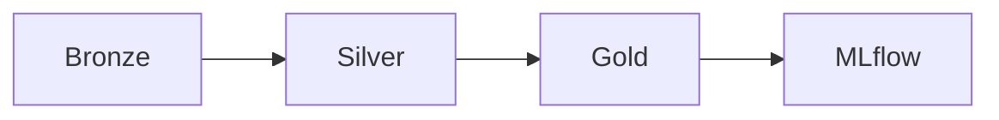

# datascience-as-a-service

> **Note:** This project is not yet tested. Tests will be added incrementally.

> **This is a template.** Assets, resources, checks, and schedules are provided as starting points. Rename, adjust, or delete anything that doesn't fit your use case.

An end-to-end data science platform built on **Dagster**, following a **medallion architecture** (bronze → silver → gold) with Delta Lake storage on S3/RustFS, ML training via any ML framework + Optuna, and experiment tracking with MLflow.

---

## Architecture



Each layer reads from and writes to **Delta Lake tables** on S3 (RustFS) using UPSERT merge semantics for idempotent writes. Downstream layers use Dagster's `AutomationCondition.eager()` to auto-materialise when upstream assets complete.

---

## Project Structure

```
src/datascience_as_a_service/
├── definitions.py          # Dagster entry point (auto-discovers defs/)
└── defs/
│   ├── bronze/
│   │   ├── assets.py        # Bronze asset definitions (data ingestion)
│   │   ├── checks.py        # Checks for bronze assets (e.g. row counts)
│   │   ├── schedules.py     # Schedules for bronze assets
│   │   └── sensors.py       # Sensors for bronze assets (e.g. file watchers)
│   ├── silver/
│   │   ├── assets.py        # Silver asset definitions (data cleaning, joins)
│   │   ├── checks.py        # Checks for silver assets (e.g. null counts)
│   │   ├── schedules.py     # Schedules for silver assets
│   │   └── sensors.py       # Sensors for silver assets
│   ├── gold/
│   │   ├── assets.py        # Gold asset definitions (aggregations, features)
│   │   ├── checks.py        # Checks for gold assets (e.g. value ranges)
│   │   ├── schedules.py     # Schedules for gold assets
│   │   └── sensors.py       # Sensors for gold assets
│   ├── mlflow/
│   │   ├── assets.py        # ML assets (model training, evaluation)
│   │   ├── checks.py        # Checks for ML assets (e.g. model performance)
│   │   ├── schedules.py     # Schedules for ML assets
│   │   └── sensors.py       # Sensors for ML assets (e.g. new data triggers)
│   └── resources.py         # Resource definitions (e.g. Postgres, S3, MLflow)
├── transformations/         # Reusable transformation functions (e.g. data cleaning, feature engineering)
│   ├── bronze.py            # Transformations for bronze layer
│   ├── silver.py            # Transformations for silver layer
│   └── gold.py              # Transformations for gold layer
├── definitions.py           # Dagster entry point (auto-discovers defs/)
└── utils.py                 # Utility functions (e.g. Delta Lake upsert helper)
```

To add a new asset, create or extend a file in `defs/`. Dagster auto-discovers everything via `load_from_defs_folder()`.

> **Dev tip:** The `dagster-user-code` container mounts `./src` as a volume, so code changes are reflected without rebuilding.

---

## Infrastructure (Docker Compose)

| Service               | Port        | Description                                                                 |
| --------------------- | ----------- | --------------------------------------------------------------------------- |
| **RustFS**            | 9000 / 9001 | S3-compatible object storage                                                |
| **PostgreSQL**        | 5432        | Dagster run/event storage &amp; MLflow backend                              |
| **MLflow**            | 5001        | Experiment tracking server                                                  |
| **Dagster webserver** | 3000        | Dagster UI &amp; scheduler                                                  |
| **Dagster daemon**    | —           | Runs schedules, sensors, and the run queue                                  |
| **Dagster user code** | gRPC        | User code execution server                                                  |
| **createbuckets**     | —           | Init container: creates `mlflow`, `raw`, `bronze`, `silver`, `gold` buckets |

Start everything:

```bash
docker compose up
```

### Service URLs (defaults)

| Service         | URL                   | Credentials                      |
| --------------- | --------------------- | -------------------------------- |
| Dagster UI      | http://localhost:3000 | —                                |
| MLflow UI       | http://localhost:5001 | —                                |
| RustFS Console  | http://localhost:9001 | `dp_rustfs_user` / `supersecret` |
| RustFS API (S3) | http://localhost:9000 | `dp_rustfs_user` / `supersecret` |

All ports and credentials can be overridden with environment variables — see `.env.example`.

---

## Assets

### Bronze (ingestion)

| Asset             | Source          | Method                      |
| ----------------- | --------------- | --------------------------- |
| `ingest_sql`      | SQL (any dialect via connection string) | connectorx → Delta (UPSERT) |
| `ingest_duckdb`   | DuckDB          | duckdb → Delta              |
| `ingest_http`     | REST API        | httpx → Delta               |
| `ingest_csv`      | S3 CSV file     | s3fs → Polars               |
| `ingest_parquet`  | S3 Parquet file | s3fs → Polars               |
| `ingest_xlsx`     | S3 Excel file   | s3fs → Polars               |
| `ingest_json`     | S3 JSON file    | s3fs → Polars               |
| `ingest_ndjson`   | S3 NDJSON file  | s3fs → Polars               |

### Silver / Gold

- **Silver** — Deduplication, null handling, type casting, joins, business logic
- **Gold** — Final aggregations and feature sets for ML

### ML (MLflow)

- **`assets_mlflow`** — XGBoost regressor with Optuna hyperparameter tuning (50 trials). Logs params, metrics (`train_rmse`, `test_rmse`, `test_mae`, `test_r2`), and the model to MLflow.

---

## Resources

| Key             | Class              | Description                                                  |
| --------------- | ------------------ | ------------------------------------------------------------ |
| `sql`           | `SqlResource`      | Dialect-agnostic SQL connection (via connection string)      |
| `duckdb_source` | `DuckDBResource`   | DuckDB file connector                                        |
| `http`          | `HttpResource`     | HTTP API client with token auth                              |
| `s3`            | `S3Resource`       | S3/RustFS access (Delta storage options + `s3fs` filesystem) |
| `alerts`        | `AlertResource`    | Webhook notifications (Slack-compatible), disabled if empty  |
| `mlflow`        | `mlflow_tracking`  | MLflow tracking (dagster-mlflow)                             |

All secrets are injected via `dg.EnvVar` — no plaintext credentials.

---

## Checks

- **Row-count checks** for every bronze ingestor (`check_ingest_*_not_empty`)
- **`check_model_improvement`** — compares `test_rmse` across the last two materialisations

## Schedules &amp; Sensors

- **`daily_ingest_schedule`** — cron `0 0 * * *`, targets all assets
- **`bronze_sensor`** — sensor-based trigger, targets all assets
- **`alert_on_run_failure`** — run-failure sensor, posts to `alerts` (`ALERT_WEBHOOK_URL`) whenever any run in the deployment fails. Disabled (default `STOPPED`) until turned on in the Dagster UI or via `default_status`.

---

## Getting Started

### Prerequisites

- Python **3.14** (`pyproject.toml` requires `>=3.14,<3.15`)
- [Docker](https://docs.docker.com/get-docker/) &amp; Docker Compose
- [uv](https://docs.astral.sh/uv/) (recommended) or pip

### Install

```bash
uv sync
source .venv/bin/activate
```

Or with pip:

```bash
python3 -m venv .venv
source .venv/bin/activate
pip install -e ".[dev]"
```

### Run

**Option A — fully containerised:**

```bash
docker compose up -d
```

**Option B — local dev** (run Dagster on the host, infrastructure in Docker):

```bash
# start only the backing services
docker compose up -d rustfs createbuckets postgres-mlflow postgres-dagster mlflow

# start Dagster dev server (hot-reload, no container rebuild)
dg dev
```

Open http://localhost:3000 in your browser.

---

## Tech Stack

| Category            | Tools                                  |
| ------------------- | -------------------------------------- |
| Orchestration       | Dagster 1.12                           |
| DataFrames          | Polars, Pandas                         |
| Storage             | Delta Lake on S3 (RustFS)              |
| SQL                 | DuckDB, connectorx                     |
| ML                  | XGBoost, Optuna, Prophet, scikit-learn |
| Experiment tracking | MLflow                                 |
| API / Cloud         | httpx, boto3, s3fs                     |
| Linting             | Ruff                                   |
